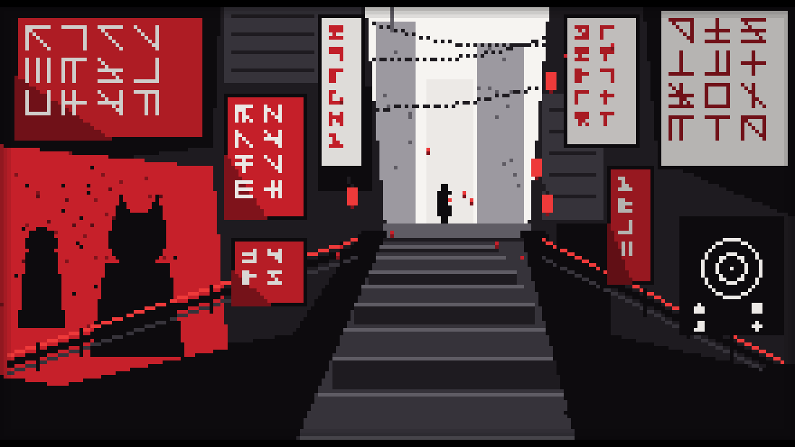

<div align="center">



# ▚ Hi there, I'm **leotu2008-ux** ▞


</div>

```bash
python3 art/generate_hero.py
```

<div align="center">

<sub>▓▓▓▓▓▓▓▓▓▓▓▓▓▓▓ starting soon — stay tuned ▓▓▓▓▓▓▓▓▓▓▓▓▓▓▓</sub>

</div>
